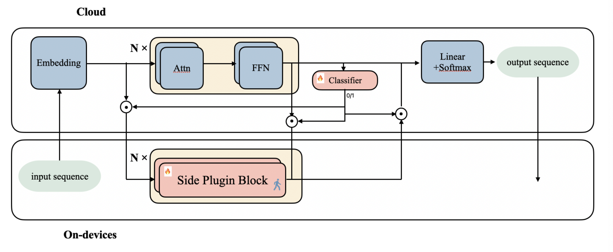

# SPA: Towards A Computational Friendly Cloud-Base and On-Devices Collaboration Seq2seq Personalized Generation

<p align="center">
</a>


</p>


This is the official repository of the paper: [SPA: Towards A Computational Friendly Cloud-Base and On-Devices Collaboration Seq2seq Personalized Generation](https://arxiv.org/abs/2403.07088).




## How to use

- Thoroughly prepare your dataset, and adjust it to the prescribed format:

```bash
{
"instruction": ...,
"input": ...,
"output": ...,
}
```

- Clone this repo.

```bash
git clone git@github.com:OceannTwT/SPA.git
```

- Replace the code on `LlamaForCausalLM` with `model/modeling_SPA.py`.

- Add your dataset in `data/dataset_info.json`.

- Tune and get the SPA model!

```bash
bash train.sh
```

- Execute the model inference by running the `llama_SPA_predict.py` script, ensuring to modify the directory in your additional parameters if necessary.

## What can it do?

- This repository is dedicated to on-device personalized Language Models (LLMs), with the potential to significantly enhance the speed and reliability of on-device LLMs.

## Acknowledgement

- We express our gratitude for the valuable contributions made by all co-authors and the dedicated efforts of the Siri-China teams involved in this project.

## 🛠️Update logs

[24/08/20] 🔥 We are happy to announce that SPA has been accepted to PRICAI 2024 main conference(oral)! 

## Citation

If you use the SPA for your work, please cite:

```bibtex 
@misc{liu2024spa,
      title={SPA: Towards A Computational Friendly Cloud-Base and On-Devices Collaboration Seq2seq Personalized Generation}, 
      author={Yanming Liu and Xinyue Peng and Jiannan Cao and Le Dai and Xingzu Liu and Weihao Liu and Mingbang Wang},
      year={2024},
      eprint={2403.07088},
      archivePrefix={arXiv},
      primaryClass={cs.CL}
}
